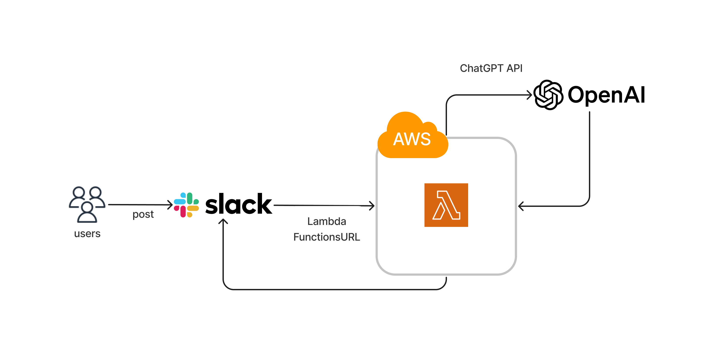

## AIを搭載したSlackbot
**メンテナンス終了。依存ライブラリの更新等により動作しない可能性がある**

<!-- * TODO
    * CodePipelineを構築し、mainブランチにpushでデプロイする
    * Amazon Bedrockを利用してみる(モデルはclaude2など)
    * FunctionsURLからAPI Gatewayに変更 -->

### 仕様
* Botを使用できるのは特定のオープンチャンネルに限定する。
* 質問はBotにメンションして開始し、Botは発言したユーザーにメンションしてスレッドで返信を行う。  
チャンネルに投稿しただけ、またはスレッドに返信しただけなど、メンションしない限りBotは反応しない。  
（Botが反応するとチャンネル内、スレッド内でユーザー同士のやり取りがしづらいため）
* 応答するのに時間がかかるので、処理中であることを示すためにBotは発言に対して先にリアクションをつける。
* スレッドの内容に関してはBotは記憶がある状態で話ができる。

### 構成
* Lambda + Lambda FunctionsURL + Slack SDK + LangChainGo + Bedrock
    * Lambdaランタイム: al2023 Go
    * SlackのSecretなどはParameter StoreにSecureStringで保管し、環境変数で保持
    * CodeBuild + GitHub Webhookトリガーでpushを起点にAWS SAMでデプロイする



<!-- #### 開発時 OpenAI APK Keyの設定
```sh
cd .devcontainer
cp .variables.env.dummy .variables.env
# 開いて MyOpenAPIKey を自分のapi keyに変更
``` -->

#### 環境変数
* `AI_MODEL_PROVIDER`: LLMプロバイダ名（例: `anthropic`）
* `AI_MODEL_ID`: AWS Bedrockのモデルまたは推論プロファイルID（例: `global.anthropic.claude-sonnet-4-6`）

#### 注意事項
* Lambdaのタイムアウトは3分、動作しない場合はメモリを256MB以上とする
